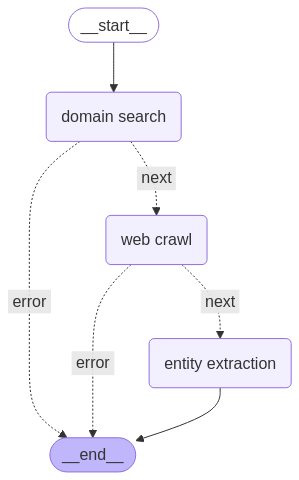

# Deep Job Search Agent

This project uses a LangGraph agent with Tavily to search, crawl, and extract job posting data from the web. It leverages OpenAI's LLM to extract key entities from the job postings like job title, location, and benefits.

## Configuration

You can modify the application configuration in `src/utils/config.py`:

- `DEFAULT_MODEL`: The OpenAI model to use
- `DEFAULT_CRAWL_LIMIT`: The maximum number of pages to crawl -- set to 30 by default...feel free to play around.
- `DEFAULT_EXTRACT_DEPTH`: Set to `advanced` to retrieve more data, including tables and embedded content, with higher success.


## Features

- **Tavily `/Search`**: Identifies the optimal job posting domain for any specified company
- **Tavily `/Crawl`**: Intelligently navigates the career domain to discover all job posting links and extract relevant content
  - Utilizes `select_paths` and `select_domains` filtering parameters to precisely target job postings
- **Advanced Entity Recognition**: Extracts structured data (job titles, locations, benefits) from web content using OpenAI's LLM capabilities
- **LangGraph Orchestration**: Coordinates the entire workflow through a sophisticated agent-based architecture

Note: control the number of pages to crawl in `src/utils/config.py` with the `DEFAULT_CRAWL_LIMIT` variable. Currently set to 30 to limit api consumption.


## Agent Workflow



## Setup

1. Clone the repository
2. Create and activate a virtual environment
```bash
python3 -m venv venv
source venv/bin/activate
```
3. Install dependencies
```bash
python3 -m pip install -r requirements.txt
```
3. Create a `.env` file with your API keys:
   ```
   TAVILY_API_KEY=your_tavily_api_key
   OPENAI_API_KEY=your_openai_api_key
   ```

## Usage

Run the agent with a company name from the root directory of this repo. For example:
```bash

python3 job_search/src/main.py "HiBob"
```

## Example Output

The results will be saved to `job_search_results.json` by default. 

The agent produces a structured JSON output containing the Tavily Search result ()`domain_search_result`), Tavily Crawl result (`crawl_result`), and agent output (`extracted job entities`). Here's a sample of what the output looks like:

```json
{
  "company_name": "HiBob",
  "domain_search_result": {
    "query": "HiBob careers",
    "top_urls": [
      "https://www.hibob.com/careers/",
      "https://uk.linkedin.com/company/hibob/jobs",
      "https://www.indeed.com/cmp/Hibob"
    ],
    "selected_domain": "https://www.hibob.com/careers/"
  },
  "crawl_result": {
    "domain": "https://www.hibob.com/careers/",
    "links": [
      "https://hibob-e013d08dd01044.careers.hibob.com/jobs/98c12943-f07c-4b0b-9bc6-3f1de303c019",
      "https://hibob-e013d08dd01044.careers.hibob.com/jobs/3a5b4e08-40b0-425d-b41f-f18e5d85ea0e",
      // ... more links ...
    ]
  },
  "extract_result": {
    "extracted_jobs": [
      {
        "title": "Procurement Buyer –SaaS & IT Hardware",
        "location": "IL, Israel",
        "url": "https://hibob-e013d08dd01044.careers.hibob.com/jobs/98c12943-f07c-4b0b-9bc6-3f1de303c019"
      },
      {
        "title": "Senior Data Engineer",
        "location": "IL, Israel",
        "url": "https://hibob-e013d08dd01044.careers.hibob.com/jobs/3a5b4e08-40b0-425d-b41f-f18e5d85ea0e"
      },
      // ... more jobs ...
    ]
  }
}
```

## Project Structure

- `src/agents/`: Contains the agent nodes (domain_search, crawl, extract)
- `src/models/`: Contains the Pydantic models for structured data
- `src/utils/`: Contains utility functions and configuration
- `src/main.py`: Main script to run the agent